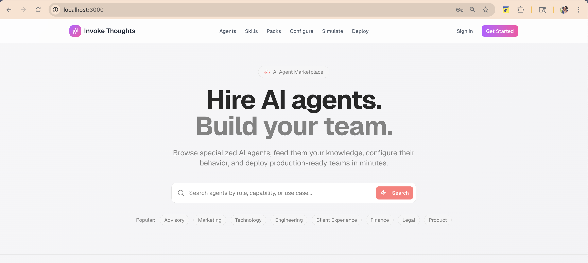

# HackBlk2026 Frontend

This is the frontend for the HackBlk2026 project. It is a Next.js application that uses Tailwind CSS for styling.

## Setup

1. Install dependencies: `npm i`
2. Run the development server: `npm run dev`
3. Open [http://localhost:3000](http://localhost:3000) with your browser to see the result.

## License

This project is licensed under the MIT License.

 

