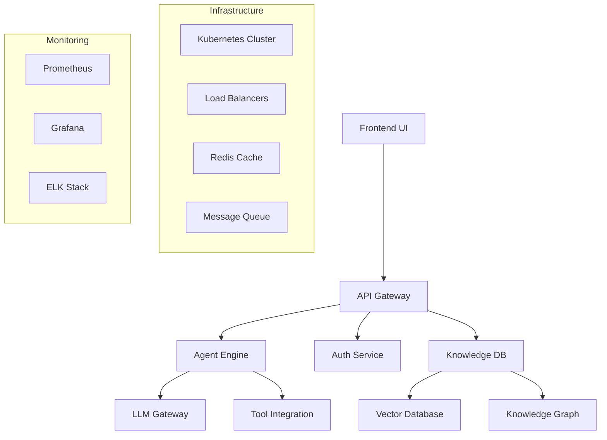
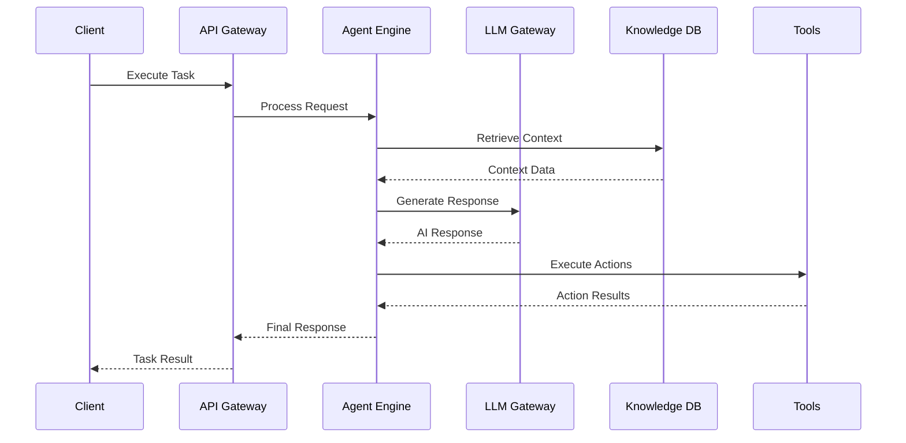
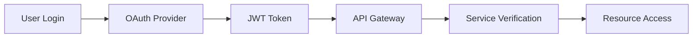

# AI Workforce Architecture

## System Overview

AI Workforce is built on a microservices architecture that enables scalability, reliability, and seamless integration with existing enterprise systems.

## Core Components



## Frontend Layer

### Web Application
- **Framework**: React with TypeScript
- **UI Library**: Material-UI / Tailwind CSS
- **State Management**: Redux Toolkit
- **Real-time Updates**: WebSocket connections

### Mobile Application
- **Framework**: React Native
- **Platform Support**: iOS, Android
- **Offline Support**: Local storage and sync

## API Gateway

### Responsibilities
- Request routing and load balancing
- Authentication and authorization
- Rate limiting and throttling
- Request/response transformation
- API versioning

### Configuration
```yaml
apiVersion: v1
kind: Ingress
metadata:
  name: ai-workforce-ingress
spec:
  rules:
  - host: api.aiworkforce.com
    http:
      paths:
      - path: /v1
        backend:
          serviceName: api-gateway
          servicePort: 80
```

## Core Services

### Agent Engine
- **Language**: Python with FastAPI
- **Responsibilities**: Agent orchestration, task execution, team coordination
- **Scaling**: Horizontal scaling with Kubernetes
- **Performance**: Sub-second response times

### Authentication Service
- **Protocol**: OAuth 2.0 + JWT
- **Features**: Multi-factor auth, SSO, RBAC
- **Storage**: PostgreSQL with encrypted credentials

### Knowledge Database
- **Vector Storage**: Pinecone / Weaviate
- **Graph Database**: Neo4j
- **Search**: Elasticsearch for full-text search
- **Cache**: Redis for frequently accessed data

## Data Flow

### Agent Execution Pipeline



## Database Architecture

### Relational Data (PostgreSQL)
```sql
-- Users and Organizations
CREATE TABLE organizations (
    id UUID PRIMARY KEY,
    name VARCHAR(255) NOT NULL,
    created_at TIMESTAMP DEFAULT NOW()
);

CREATE TABLE users (
    id UUID PRIMARY KEY,
    organization_id UUID REFERENCES organizations(id),
    email VARCHAR(255) UNIQUE NOT NULL,
    role VARCHAR(50) NOT NULL
);

-- Agent Packs and Configurations
CREATE TABLE agent_packs (
    id UUID PRIMARY KEY,
    organization_id UUID REFERENCES organizations(id),
    name VARCHAR(255) NOT NULL,
    configuration JSONB NOT NULL,
    status VARCHAR(50) DEFAULT 'active'
);
```

### Vector Storage (Pinecone)
```python
# Knowledge embedding structure
{
    "id": "doc_123_chunk_456",
    "values": [0.1, 0.2, 0.3, ...],  # 1536-dimensional vector
    "metadata": {
        "source": "company_handbook.pdf",
        "page": 42,
        "organization": "org_789",
        "category": "hr_policy"
    }
}
```

## Security Architecture

### Defense in Depth

1. **Network Security**
   - VPC isolation
   - Firewall rules
   - DDoS protection
   - TLS 1.3 encryption

2. **Application Security**
   - Input validation
   - SQL injection prevention
   - XSS protection
   - CSRF tokens

3. **Data Security**
   - Encryption at rest (AES-256)
   - Encryption in transit (TLS)
   - PII redaction
   - Data access logging

### Authentication Flow



## Scalability Design

### Horizontal Scaling
- **Stateless Services**: All services designed to be stateless
- **Load Balancing**: Multiple instances behind load balancers
- **Database Sharding**: Horizontal partitioning for large datasets
- **Caching Strategy**: Multi-level caching (Redis, CDN)

### Performance Optimization
- **Connection Pooling**: Database connection reuse
- **Async Processing**: Non-blocking I/O operations
- **Batch Processing**: Bulk operations for efficiency
- **CDN Integration**: Static content delivery

## Monitoring & Observability

### Metrics Collection
```yaml
# Prometheus configuration
global:
  scrape_interval: 15s

scrape_configs:
  - job_name: 'ai-workforce'
    static_configs:
      - targets: ['api-gateway:9090', 'agent-engine:9091']
    metrics_path: /metrics
    scrape_interval: 5s
```

### Logging Strategy
- **Structured Logging**: JSON format with consistent fields
- **Log Levels**: DEBUG, INFO, WARN, ERROR, FATAL
- **Centralized Logging**: ELK stack (Elasticsearch, Logstash, Kibana)
- **Log Retention**: 30 days default, configurable per organization

### Distributed Tracing
- **OpenTelemetry**: Standardized tracing implementation
- **Jaeger**: Distributed tracing system
- **Span Context**: Request correlation across services
- **Performance Analysis**: Bottleneck identification

## Deployment Architecture

### Kubernetes Configuration

```yaml
apiVersion: apps/v1
kind: Deployment
metadata:
  name: agent-engine
spec:
  replicas: 3
  selector:
    matchLabels:
      app: agent-engine
  template:
    metadata:
      labels:
        app: agent-engine
    spec:
      containers:
      - name: agent-engine
        image: aiworkforce/agent-engine:v1.0.0
        ports:
        - containerPort: 8000
        env:
        - name: DATABASE_URL
          valueFrom:
            secretKeyRef:
              name: db-secret
              key: url
```

### High Availability
- **Multi-Region Deployment**: US, EU, APAC regions
- **Failover Logic**: Automatic failover between regions
- **Health Checks**: Regular service health monitoring
- **Backup Strategy**: Automated backups and disaster recovery

## Integration Points

### External Services
- **LLM Providers**: OpenAI, Anthropic, Google AI
- **Communication Platforms**: Slack, Microsoft Teams
- **Documentation Systems**: Notion, Confluence
- **Analytics**: Google Analytics, Mixpanel

### Webhook System
```javascript
// Webhook event structure
{
  "eventId": "evt_123456789",
  "eventType": "task.completed",
  "timestamp": "2024-01-15T10:30:00Z",
  "data": {
    "taskId": "task_abc123",
    "teamId": "team_def456",
    "result": {...},
    "metadata": {...}
  },
  "signature": "sha256=..."
}
```

## Development Workflow

### CI/CD Pipeline
```yaml
# GitHub Actions workflow
name: Deploy AI Workforce
on:
  push:
    branches: [main]

jobs:
  test:
    runs-on: ubuntu-latest
    steps:
      - uses: actions/checkout@v3
      - name: Run tests
        run: pytest tests/
  
  deploy:
    needs: test
    runs-on: ubuntu-latest
    steps:
      - name: Deploy to Kubernetes
        run: kubectl apply -f k8s/
```

### Environment Management
- **Development**: Local development with Docker Compose
- **Staging**: Production-like environment for testing
- **Production**: Multi-region Kubernetes cluster
- **Feature Flags**: Gradual rollout and A/B testing

This architecture ensures AI Workforce can handle enterprise-scale workloads while maintaining security, reliability, and performance standards.
