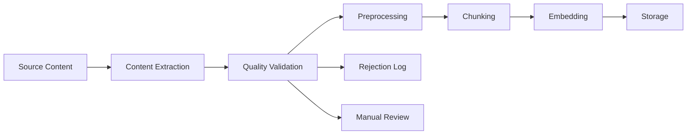
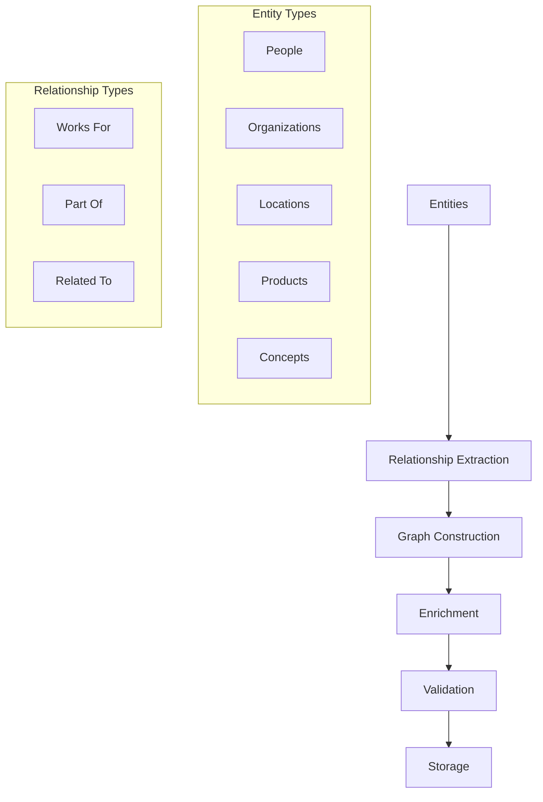

# Knowledge Feeding System

The Knowledge Feeding System enables you to inject organization-specific knowledge into your AI agents, transforming them from general-purpose assistants into domain experts that understand your business context, processes, and proprietary information.

## Overview

Knowledge feeding transforms raw information sources into structured, searchable knowledge that AI agents can access during task execution. This process ensures your agents have accurate, up-to-date information specific to your organization.

## Input Methods

### Web Scraping
Automatically extract knowledge from public websites and internal web portals.

```javascript
const knowledgeFeed = await workforce.createKnowledgeSource({
  type: 'web-scraping',
  config: {
    urls: [
      'https://your-company.com/docs',
      'https://your-company.com/blog',
      'https://wiki.your-company.com'
    ],
    selectors: {
      title: 'h1, h2',
      content: 'main, article',
      metadata: '.meta, .tags'
    },
    schedule: '0 2 * * *', // Daily at 2 AM
    depth: 3, // Crawl depth
    respectRobotsTxt: true
  }
});
```

**Features**:
- JavaScript rendering support
- Automatic content extraction
- Incremental updates
- Error handling and retry logic

### Documentation Processing
Process structured documentation from various formats.

```javascript
const docSource = await workforce.createKnowledgeSource({
  type: 'documentation',
  config: {
    sources: [
      {
        type: 'confluence',
        url: 'https://your-company.atlassian.net/wiki',
        credentials: {
          username: 'api-user',
          token: process.env.CONFLUENCE_TOKEN
        },
        spaces: ['HR', 'ENG', 'PRODUCT']
      },
      {
        type: 'notion',
        databaseId: 'notion-db-123',
        token: process.env.NOTION_TOKEN
      }
    ],
    filters: {
      includeArchived: false,
      dateRange: 'last-90-days'
    }
  }
});
```

**Supported Platforms**:
- Confluence
- Notion
- SharePoint
- GitBook
- Custom APIs

### File Upload
Upload and process documents in various formats.

```javascript
const fileSource = await workforce.createKnowledgeSource({
  type: 'file-upload',
  config: {
    files: [
      {
        name: 'employee-handbook.pdf',
        content: fileBuffer,
        metadata: {
          department: 'HR',
          category: 'policy',
          lastUpdated: '2024-01-15'
        }
      }
    ],
    processing: {
      extractImages: true,
      extractTables: true,
      extractMetadata: true,
      ocrEnabled: true
    }
  }
});
```

**Supported Formats**:
- PDF (including scanned documents with OCR)
- Microsoft Word (.docx)
- Microsoft PowerPoint (.pptx)
- Microsoft Excel (.xlsx)
- Plain text (.txt)
- Markdown (.md)
- HTML (.html)

### Knowledge Base Integration
Connect to existing knowledge management systems.

```javascript
const kbSource = await workforce.createKnowledgeSource({
  type: 'knowledge-base',
  config: {
    systems: [
      {
        type: 'zendesk',
        subdomain: 'your-company',
        credentials: {
          username: 'api@your-company.com',
          token: process.env.ZENDESK_TOKEN
        },
        filters: {
          categories: ['customer-support', 'technical-docs'],
          locales: ['en', 'es']
        }
      },
      {
        type: 'salesforce',
        instance: 'your-company.my.salesforce.com',
        credentials: {
          clientId: process.env.SF_CLIENT_ID,
          clientSecret: process.env.SF_CLIENT_SECRET
        },
        objects: ['Knowledge__kav', 'FAQ__kav']
      }
    ]
  }
});
```

## Processing Pipeline

### 1. Content Extraction and Validation
The first step extracts raw content from sources and validates its quality.



**Validation Checks**:
- Content quality and completeness
- Duplicate detection
- Format verification
- Size limits (max 50MB per file)
- Language detection

### 2. Text Preprocessing and Cleaning
Clean and normalize text content for optimal processing.

```python
# Preprocessing pipeline
def preprocess_text(text):
    # Remove HTML tags
    text = re.sub(r'<[^>]+>', '', text)
    
    # Normalize whitespace
    text = re.sub(r'\s+', ' ', text)
    
    # Remove special characters
    text = re.sub(r'[^\w\s\.\,\!\?]', '', text)
    
    # Language detection and filtering
    if detect_language(text) not in SUPPORTED_LANGUAGES:
        raise UnsupportedLanguageError()
    
    return text.strip()
```

**Cleaning Steps**:
- HTML tag removal
- Whitespace normalization
- Special character handling
- Language detection
- Encoding standardization

### 3. Semantic Chunking and Embedding
Split content into meaningful chunks and generate embeddings.

```javascript
const chunkingConfig = {
  strategy: 'semantic',
  parameters: {
    maxChunkSize: 1000, // tokens
    overlap: 100, // tokens
    minChunkSize: 200,
    separators: ['\n\n', '\n', '. ', ' '],
    respectSentenceBoundaries: true
  }
};

const embeddingConfig = {
  model: 'text-embedding-3-large',
  dimensions: 3072,
  batchSize: 100
};
```

**Chunking Strategies**:
- **Semantic**: Break at natural semantic boundaries
- **Fixed-size**: Equal-sized chunks
- **Hybrid**: Combine semantic and size-based approaches
- **Hierarchical**: Multi-level chunking for complex documents

### 4. Vector Storage and Indexing
Store chunks in vector database for efficient retrieval.

```javascript
const vectorStore = await workforce.createVectorStore({
  provider: 'pinecone',
  config: {
    indexName: 'ai-workforce-knowledge',
    dimension: 3072,
    metric: 'cosine',
    pods: 1,
    replicas: 2,
    podType: 'p1.x1'
  },
  metadata: {
    organization: 'your-company',
    environment: 'production',
    lastUpdated: new Date().toISOString()
  }
});
```

**Storage Features**:
- Automatic indexing
- Metadata filtering
- Real-time updates
- Backup and replication
- Access control

### 5. Knowledge Graph Construction
Build relationships between knowledge entities.



## Configuration Options

### Source Configuration
Configure how knowledge sources are processed and updated.

```javascript
const sourceConfig = {
  // Update frequency
  schedule: {
    type: 'cron',
    expression: '0 2 * * *', // Daily at 2 AM
    timezone: 'America/New_York'
  },
  
  // Processing options
  processing: {
    extractImages: true,
    extractTables: true,
    extractMetadata: true,
    ocrEnabled: true,
    languageDetection: true
  },
  
  // Quality control
  quality: {
    minContentLength: 100,
    maxContentLength: 100000,
    requiredFields: ['title', 'content'],
    blacklist: ['spam', 'test', 'draft']
  },
  
  // Security
  security: {
    piiDetection: true,
    dataMasking: true,
    accessControl: 'role-based',
    auditLogging: true
  }
};
```

### Access Control
Control who can access and modify knowledge sources.

```javascript
const accessConfig = {
  roles: {
    'admin': {
      permissions: ['read', 'write', 'delete', 'manage'],
      sources: ['*']
    },
    'editor': {
      permissions: ['read', 'write'],
      sources: ['hr-docs', 'product-docs']
    },
    'viewer': {
      permissions: ['read'],
      sources: ['public-docs']
    }
  },
  
  attributes: {
    department: ['hr', 'engineering', 'product', 'sales'],
    securityLevel: ['public', 'internal', 'confidential', 'secret'],
    region: ['us', 'eu', 'apac']
  }
};
```

## API Examples

### Create Knowledge Source
```bash
curl -X POST "https://api.aiworkforce.com/v1/knowledge/sources" \
  -H "Authorization: Bearer $AIWORKFORCE_API_KEY" \
  -H "Content-Type: application/json" \
  -d '{
    "name": "Company Handbook",
    "type": "file-upload",
    "config": {
      "files": [
        {
          "url": "https://your-company.com/handbook.pdf",
          "metadata": {
            "department": "HR",
            "category": "policy"
          }
        }
      ]
    }
  }'
```

### Query Knowledge Base
```bash
curl -X POST "https://api.aiworkforce.com/v1/knowledge/query" \
  -H "Authorization: Bearer $AIWORKFORCE_API_KEY" \
  -H "Content-Type: application/json" \
  -d '{
    "query": "What is the vacation policy?",
    "filters": {
      "department": "HR",
      "category": "policy"
    },
    "limit": 5,
    "threshold": 0.7
  }'
```

### Update Knowledge Source
```bash
curl -X PUT "https://api.aiworkforce.com/v1/knowledge/sources/source_123" \
  -H "Authorization: Bearer $AIWORKFORCE_API_KEY" \
  -H "Content-Type: application/json" \
  -d '{
    "schedule": "0 3 * * *",
    "processing": {
      "extractImages": false
    }
  }'
```

## Best Practices

### Content Organization
- **Logical Grouping**: Organize content by department, project, or topic
- **Consistent Metadata**: Use standardized tags and categories
- **Version Control**: Track document versions and updates
- **Quality Standards**: Establish content quality guidelines

### Security Considerations
- **PII Protection**: Enable automatic PII detection and masking
- **Access Control**: Implement role-based access controls
- **Audit Trails**: Log all knowledge access and modifications
- **Data Classification**: Classify content by sensitivity level

### Performance Optimization
- **Chunk Size**: Optimize chunk sizes for your use case
- **Indexing Strategy**: Use appropriate indexing strategies
- **Caching**: Implement caching for frequently accessed content
- **Monitoring**: Monitor query performance and optimize accordingly

## Monitoring and Analytics

### Knowledge Base Metrics
Track the health and usage of your knowledge base.

```javascript
const metrics = await workforce.getKnowledgeMetrics({
  timeRange: '30d',
  granularity: 'day'
});

// Metrics include:
// - Total documents processed
// - Processing success rate
// - Query volume and patterns
// - Popular content
// - Search accuracy
```

### Quality Assurance
Monitor content quality and identify improvement opportunities.

```javascript
const qualityReport = await workforce.getQualityReport({
  sourceId: 'source_123',
  metrics: [
    'completeness',
    'accuracy',
    'freshness',
    'relevance'
  ]
});
```

## Troubleshooting

### Common Issues

#### Processing Failures
```bash
# Check processing status
curl -X GET "https://api.aiworkforce.com/v1/knowledge/sources/source_123/status"

# Common solutions:
# - Verify file format compatibility
# - Check file size limits
# - Ensure proper authentication
# - Review source accessibility
```

#### Poor Search Results
```javascript
// Improve search relevance
const searchConfig = {
  reranking: {
    enabled: true,
    model: 'rerank-v3.5'
  },
  filters: {
    boostRecent: true,
    boostPopular: true
  }
};
```

#### Performance Issues
```javascript
// Optimize query performance
const optimizationConfig = {
  caching: {
    enabled: true,
    ttl: 3600, // 1 hour
    maxSize: 1000
  },
  indexing: {
    strategy: 'hybrid',
    refreshInterval: '1h'
  }
};
```

## Integration with Agent Packs

Connect knowledge sources to specific agent packs for specialized expertise.

```javascript
const specializedPack = await workforce.createPack({
  name: 'HR Support Team',
  agents: ['hr-specialist', 'policy-expert'],
  knowledge: {
    sources: ['hr-handbook', 'company-policies', 'benefits-info'],
    accessLevel: 'hr-only',
    updateFrequency: 'daily'
  },
  configuration: {
    knowledgeWeight: 0.8, // Weight given to knowledge vs general AI
    confidenceThreshold: 0.7
  }
});
```

<Note>
  **Pro Tip**: Start with a small pilot knowledge base and gradually expand based on agent performance and user feedback.
</Note>
