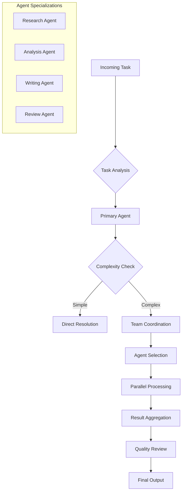

# Pack Builder

The Pack Builder enables you to assemble coordinated teams of AI agents that work together to solve complex business problems. Create specialized agent packs with complementary skills, shared memory, and coordinated workflows.

## Overview

Agent packs are collections of specialized AI agents that collaborate on tasks, share context, and coordinate their actions to achieve complex objectives that would be difficult for individual agents to handle alone.

## Pack Composition

### Agent Selection
Choose agents that complement each other's capabilities.

```javascript
const customerServicePack = await workforce.createPack({
  name: 'Customer Service Team',
  agents: [
    {
      id: 'customer-support-specialist',
      role: 'Primary Handler',
      priority: 1,
      capabilities: ['ticket-analysis', 'customer-communication']
    },
    {
      id: 'technical-triage-agent',
      role: 'Technical Support',
      priority: 2,
      capabilities: ['troubleshooting', 'escalation-detection']
    },
    {
      id: 'escalation-manager',
      role: 'Escalation Handler',
      priority: 3,
      capabilities: ['complex-issue-resolution', 'management-communication']
    }
  ],
  coordination: {
    handoffCriteria: {
      'customer-support-specialist': ['technical-issue', 'escalation-required'],
      'technical-triage-agent': ['complex-technical', 'senior-level-needed']
    }
  }
});
```

### Role Definition
Define specific roles and responsibilities for each agent.

```javascript
const roleDefinitions = {
  'lead-analyst': {
    responsibilities: [
      'Coordinate team efforts',
      'Review final outputs',
      'Ensure quality standards'
    ],
    authority: {
      canDelegate: true,
      canApprove: true,
      canEscalate: true
    },
    interaction: {
      primary: true,
      frequency: 'always'
    }
  },
  'research-specialist': {
    responsibilities: [
      'Gather information',
      'Validate sources',
      'Provide data insights'
    ],
    authority: {
      canDelegate: false,
      canApprove: false,
      canEscalate: true
    },
    interaction: {
      primary: false,
      frequency: 'on-demand'
    }
  }
};
```

## Skill Configuration

### Core Skills
Fundamental capabilities available to all agents.

```javascript
const coreSkills = {
  'web-research': {
    description: 'Search and gather information from the web',
    tools: ['google-search-api', 'serpapi'],
    parameters: {
      maxResults: 10,
      timeout: 30,
      safeSearch: true
    }
  },
  'document-analysis': {
    description: 'Analyze and extract information from documents',
    tools: ['pdf-parser', 'ocr-engine'],
    parameters: {
      extractImages: true,
      extractTables: true,
      languageDetection: true
    }
  },
  'data-extraction': {
    description: 'Extract structured data from unstructured text',
    tools: ['nlp-processor', 'regex-engine'],
    parameters: {
      confidenceThreshold: 0.8,
      validationRules: true
    }
  },
  'summarization': {
    description: 'Create concise summaries of long content',
    tools: ['summarization-model'],
    parameters: {
      maxLength: 500,
      style: 'executive',
      keyPoints: true
    }
  }
};
```

### Specialized Skills
Domain-specific capabilities for particular use cases.

```javascript
const specializedSkills = {
  'financial-modeling': {
    description: 'Create financial models and projections',
    tools: ['excel-integration', 'financial-calculators'],
    parameters: {
      modelTypes: ['DCF', 'NPV', 'IRR'],
      timeHorizons: ['1y', '3y', '5y'],
      scenarios: ['base', 'best', 'worst']
    },
    prerequisites: ['data-analysis', 'excel-operations']
  },
  'legal-compliance': {
    description: 'Ensure regulatory compliance',
    tools: ['regulation-database', 'compliance-checker'],
    parameters: {
      jurisdictions: ['US', 'EU', 'APAC'],
      frameworks: ['GDPR', 'SOX', 'HIPAA'],
      riskLevels: ['low', 'medium', 'high']
    }
  },
  'market-research': {
    description: 'Conduct comprehensive market analysis',
    tools: ['market-data-api', 'competitor-analyzer'],
    parameters: {
      analysisTypes: ['SWOT', 'PESTEL', 'Porter'],
      dataSources: ['industry-reports', 'competitor-data'],
      timeframes: ['historical', 'current', 'forecast']
    }
  }
};
```

### Output Formats
Configure how agents format their outputs.

```javascript
const outputFormats = {
  'markdown': {
    description: 'Structured markdown documents',
    extensions: ['.md'],
    features: ['headers', 'lists', 'tables', 'code-blocks']
  },
  'json': {
    description: 'Structured JSON data',
    extensions: ['.json'],
    features: ['nested-objects', 'arrays', 'schema-validation']
  },
  'csv': {
    description: 'Tabular data in CSV format',
    extensions: ['.csv'],
    features: ['headers', 'data-types', 'delimiters']
  },
  'pdf': {
    description: 'Formatted PDF documents',
    extensions: ['.pdf'],
    features: ['formatting', 'images', 'headers-footers']
  }
};
```

## Tool Integration

### Search APIs
Connect to external search and data services.

```javascript
const searchTools = {
  'google-search-api': {
    provider: 'google',
    authentication: {
      type: 'api-key',
      key: process.env.GOOGLE_API_KEY
    },
    capabilities: ['web-search', 'image-search', 'news-search'],
    limits: {
      queriesPerDay: 1000,
      resultsPerQuery: 10
    }
  },
  'serpapi': {
    provider: 'serpapi',
    authentication: {
      type: 'api-key',
      key: process.env.SERPAPI_KEY
    },
    capabilities: ['organic-search', 'local-search', 'shopping-search'],
    features: ['advanced-filters', 'location-based']
  }
};
```

### Web Scraping
Extract data from websites automatically.

```javascript
const scrapingTools = {
  'browserless': {
    provider: 'browserless',
    authentication: {
      type: 'token',
      token: process.env.BROWSERLESS_TOKEN
    },
    capabilities: ['javascript-rendering', 'screenshots', 'pdf-generation'],
    configuration: {
      timeout: 30000,
      userAgent: 'AI-Workforce-Bot/1.0',
      blockResources: ['images', 'fonts']
    }
  }
};
```

### LLM Providers
Integrate with multiple language model providers.

```javascript
const llmProviders = {
  'openai': {
    models: ['gpt-4-turbo', 'gpt-3.5-turbo'],
    authentication: {
      type: 'api-key',
      key: process.env.OPENAI_API_KEY
    },
    features: ['function-calling', 'streaming', 'fine-tuning']
  },
  'anthropic': {
    models: ['claude-3-opus', 'claude-3-sonnet'],
    authentication: {
      type: 'api-key',
      key: process.env.ANTHROPIC_API_KEY
    },
    features: ['long-context', 'multimodal', 'tool-use']
  }
};
```

### Vector Databases
Store and retrieve knowledge embeddings.

```javascript
const vectorDatabases = {
  'pinecone': {
    authentication: {
      type: 'api-key',
      key: process.env.PINECONE_API_KEY
    },
    configuration: {
      environment: 'us-west1-gcp',
      indexName: 'ai-workforce-knowledge'
    },
    features: ['metadata-filtering', 'hybrid-search', 'namespaces']
  },
  'weaviate': {
    authentication: {
      type: 'api-key',
      key: process.env.WEAVIATE_API_KEY
    },
    configuration: {
      url: 'https://your-cluster.weaviate.network',
      scheme: 'https'
    },
    features: ['graphql-api', 'batch-import', 'real-time-updates']
  }
};
```

### Communication Platforms
Integrate with team communication tools.

```javascript
const communicationTools = {
  'slack': {
    authentication: {
      type: 'oauth',
      token: process.env.SLACK_TOKEN
    },
    capabilities: ['message-posting', 'file-sharing', 'channel-management'],
    features: ['threading', 'reactions', 'mentions']
  },
  'teams': {
    authentication: {
      type: 'oauth',
      token: process.env.TEAMS_TOKEN
    },
    capabilities: ['chat-messages', 'meetings', 'channels'],
    features: ['adaptive-cards', 'bots', 'tabs']
  }
};
```

### Documentation Systems
Connect to knowledge management platforms.

```javascript
const documentationTools = {
  'notion': {
    authentication: {
      type: 'oauth',
      token: process.env.NOTION_TOKEN
    },
    capabilities: ['page-creation', 'database-operations', 'search'],
    features: ['blocks', 'databases', 'comments']
  },
  'confluence': {
    authentication: {
      type: 'basic',
      username: process.env.CONFLUENCE_USER,
      password: process.env.CONFLUENCE_TOKEN
    },
    capabilities: ['page-management', 'space-admin', 'content-search'],
    features: ['macros', 'attachments', 'versioning']
  }
};
```

## Memory Management

### Memory Layers
Configure different types of memory for agent teams.

```javascript
const memoryLayers = {
  'short-term': {
    type: 'session',
    retention: '24h',
    capacity: '10MB',
    scope: 'conversation',
    features: ['context-retention', 'state-tracking']
  },
  'long-term': {
    type: 'persistent',
    retention: '90d',
    capacity: '1GB',
    scope: 'agent',
    features: ['learning', 'preference-storage', 'history-tracking']
  },
  'shared': {
    type: 'collaborative',
    retention: '30d',
    capacity: '500MB',
    scope: 'team',
    features: ['knowledge-sharing', 'coordination', 'handoff-context']
  },
  'organizational': {
    type: 'enterprise',
    retention: '1y',
    capacity: '10GB',
    scope: 'organization',
    features: ['institutional-knowledge', 'best-practices', 'compliance']
  }
};
```

### Memory Configuration
Set up memory policies and access controls.

```javascript
const memoryConfig = {
  retention: {
    policies: {
      'conversations': '30d',
      'learned-preferences': '90d',
      'error-logs': '7d',
      'performance-metrics': '1y'
    },
    cleanup: {
      schedule: '0 2 * * *', // Daily at 2 AM
      strategy: 'smart-cleanup'
    }
  },
  access: {
    permissions: {
      'agents': ['read', 'write'],
      'users': ['read'],
      'admins': ['read', 'write', 'delete']
    },
    encryption: {
      atRest: true,
      inTransit: true,
      keyRotation: '90d'
    }
  }
};
```

## Workflow Coordination

### Task Distribution
Define how tasks are distributed among agents.



### Handoff Logic
Configure when and how agents hand off tasks.

```javascript
const handoffRules = {
  triggers: {
    'complexity-threshold': {
      condition: 'task.complexity > 7',
      action: 'escalate-to-team'
    },
    'specialization-required': {
      condition: 'task.requiresSpecializedSkill',
      action: 'route-to-specialist'
    },
    'time-limit': {
      condition: 'task.duration > 300', // 5 minutes
      action: 'request-assistance'
    }
  },
  protocols: {
    'warm-handoff': {
      description: 'Share context and progress',
      steps: ['summarize-progress', 'transfer-context', 'introduce-next-agent']
    },
    'cold-handoff': {
      description: 'Minimal context transfer',
      steps: ['basic-task-info', 'priority-level', 'deadline']
    }
  }
};
```

### Collaboration Patterns
Define how agents work together.

```javascript
const collaborationPatterns = {
  'sequential': {
    description: 'Agents work in sequence',
    agents: ['researcher', 'analyzer', 'writer'],
    flow: 'linear',
    coordination: 'handoff-based'
  },
  'parallel': {
    description: 'Agents work simultaneously',
    agents: ['analyst-1', 'analyst-2', 'analyst-3'],
    flow: 'concurrent',
    coordination: 'result-aggregation'
  },
  'hierarchical': {
    description: 'Lead agent coordinates others',
    agents: ['lead-analyst', 'research-assistants', 'reviewers'],
    flow: 'tree',
    coordination: 'centralized'
  },
  'consensus': {
    description: 'Agents reach agreement together',
    agents: ['expert-1', 'expert-2', 'expert-3'],
    flow: 'collaborative',
    coordination: 'voting-based'
  }
};
```

## Quality Assurance

### Performance Metrics
Track team performance and quality.

```javascript
const qualityMetrics = {
  'task-completion': {
    metric: 'completion-rate',
    target: 0.95,
    measurement: 'percentage of tasks completed successfully'
  },
  'response-time': {
    metric: 'average-response-time',
    target: 120, // seconds
    measurement: 'time from task start to completion'
  },
  'accuracy': {
    metric: 'output-accuracy',
    target: 0.90,
    measurement: 'human-rated accuracy of outputs'
  },
  'coordination': {
    metric: 'handoff-efficiency',
    target: 0.85,
    measurement: 'smoothness of agent transitions'
  }
};
```

### Testing Framework
Test agent pack configurations before deployment.

```javascript
const testSuite = {
  'unit-tests': {
    description: 'Test individual agent capabilities',
    tests: [
      'agent-response-accuracy',
      'tool-integration',
      'memory-access'
    ]
  },
  'integration-tests': {
    description: 'Test agent coordination',
    tests: [
      'handoff-logic',
      'shared-memory',
      'workflow-execution'
    ]
  },
  'performance-tests': {
    description: 'Test under load',
    tests: [
      'concurrent-tasks',
      'resource-usage',
      'response-times'
    ]
  },
  'user-acceptance': {
    description: 'Test with real scenarios',
    tests: [
      'end-to-end-workflows',
      'edge-cases',
      'error-handling'
    ]
  }
};
```

## Example Configurations

### Customer Support Team
```javascript
const customerSupportPack = {
  name: '24/7 Customer Support',
  agents: [
    'tier-1-support', 'technical-specialist', 'escalation-manager'
  ],
  skills: ['ticket-analysis', 'troubleshooting', 'customer-communication'],
  tools: ['zendesk-integration', 'knowledge-base', 'slack'],
  memory: {
    type: 'shared',
    retention: '7d'
  },
  workflow: 'sequential-with-escalation',
  quality: {
    responseTime: 300, // 5 minutes
    satisfaction: 0.90
  }
};
```

### Marketing Content Team
```javascript
const marketingPack = {
  name: 'Content Marketing Team',
  agents: [
    'content-strategist', 'copywriter', 'seo-analyst', 'social-media-manager'
  ],
  skills: ['content-planning', 'writing', 'seo-optimization', 'social-management'],
  tools: ['google-analytics', 'semrush', 'buffer', 'wordpress'],
  memory: {
    type: 'shared',
    retention: '30d'
  },
  workflow: 'parallel-collaboration',
  quality: {
    outputQuality: 0.85,
    engagement: 0.70
  }
};
```

### Financial Analysis Team
```javascript
const financePack = {
  name: 'Financial Analysis Team',
  agents: [
    'data-analyst', 'financial-modeler', 'risk-assessor', 'report-writer'
  ],
  skills: ['data-analysis', 'financial-modeling', 'risk-assessment', 'reporting'],
  tools: ['excel-integration', 'bloomberg-api', 'risk-calculators'],
  memory: {
    type: 'long-term',
    retention: '90d'
  },
  workflow: 'hierarchical',
  quality: {
    accuracy: 0.95,
    compliance: 1.0
  }
};
```

<Note>
  **Pro Tip**: Start with simple agent packs and gradually increase complexity as you understand how agents interact and coordinate.
</Note>
